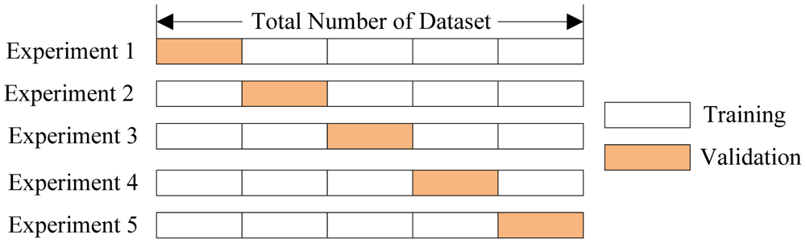

## R과 H2O를 활용한 간단한 분석 및 모델링

 - 여기서는 `h2o` 패키지를 이용하여 __Credit Card Fraud Detection__ 을 위한 모델을 생성해보도록 하겠습니다.
 - `h2o`패키지 설치관련 문서는 h2o_basic_usage_v2.html을 살펴보시기 바랍니다.
 - 사용할 데이터는 캐글에 있는 [Credit Card Fraud Detection](https://www.kaggle.com/mlg-ulb/creditcardfraud) 데이터로 각 변수들은 Time, Amount, Class(Target 변수)를 제외하고 이미 PCA라는 방법을 거쳐서 생성된 변수들(V1 ~ V28)이기 때문에 변수의 의미자체보단 분석 및 모델링에 촛점을 맞추어서 진행하도록하겠습니다.
 - 그리고 기본 사용법 관련문서와 겹치는 부분이 있으나 여기서는 다른 기능들도 같이 살펴보겠습니다.

<br>

## 데이터 탐색해보기

 - 모델링을 하기 앞서 기본적으로 데이터를 살펴보는 것은 중요한 작업들중 하나입니다.
 - 여기서는 깊게 보지않고 간단하게만 살펴보도록 하겠습니다.

### 패키지 및 데이터 불러오기

```{r fig.width=6, fig.height=6, fig.align='center', message=FALSE}
library(data.table, quietly = TRUE)
library(tidyverse, quietly = TRUE)
library(DT, quietly = TRUE)
library(h2o, quietly = TRUE)

creditcard_dt <- fread("creditcard.csv")
creditcard_dt[, Class := as.factor(Class)]
dim(creditcard_dt)
```

 - 31개의 변수와 약 28만개의 데이터가 있습니다.

```{r, echo=FALSE, results='asis'}
datatable(
  head(creditcard_dt, 10),
  options = list(scrollX = TRUE, scrollCollapse = TRUE, autoWidth = TRUE)
  )
```

### Target Level 분포
 - 0 : __Good__, 1 : __Bad__ 를 의미합니다.
 - 이들의 비율이 어떤지 확인해보도록 하겠습니다.

```{r}
creditcard_dt$Class %>% 
  as.vector() %>% 
  table(dnn = "Class") %>% 
  as.data.frame(.) %>% 
  ggplot(data = ., aes(x = as.factor(Class), y = Freq)) + 
  geom_bar(stat = "identity") + 
  geom_text(aes(label = paste0(round(Freq/sum(Freq), 8) * 100, "%"))) + 
  xlab("Target : Class") + ylab("Frequency")
```

 - Class 1의 비율이 0.17%으로 매우 낮은 수치입니다.
 - 이러한 데이터를 imbalanced data라고 합니다.
 - 이런 경우 보통 Over/Under Sampling을 수행 후 Classifier를 만들거나 Anomaly detection을 통해 Bad 케이스를 검출합니다.
 - 하지만 본 문서에서는 Over/Under Sampling 혹은 Anomaly detection을 수행하지 않고 Classifier를 그냥 만들어보도록 하겠습니다.

### V1 ~ V28 분포

 - V1부터 V28까지 각 변수별로 Class에 대해 어떻게 분포되어있는지 density plot으로 살펴보겠습니다.

```{r fig.width=12, fig.height=12, fig.align='center'}
creditcard_g <- gather(creditcard_dt, key = "PCA_key", value = "value", -Time, -Amount, -Class)
ggplot(creditcard_g, aes(x = value)) + geom_density(aes(colour = Class)) + 
  facet_wrap(~ PCA_key, nrow = 4, scales = "free")
```

 - Class에 영향을 주는지 여부를 그래프로 살펴본다면, 아래와 같이 간단하게 예상 할 수 있습니다.
    + V5, V6, V8, V15, V20, V22, V23, V25, V26, V27, V28 은 영향을 안 줄 것이다.
    + 그외에는 Class에 어느정도 영향을 줄것이다.

### Amount 분포

```{r}
creditcard_dt %>% 
  ggplot(aes(x = Amount)) + 
  geom_density(aes(colour = Class)) + 
  xlim(c(0, quantile(creditcard_dt$Amount, 0.99)))
```

 - Amount도 Class에 그다지 큰 영향을 주진 않을 것 같다고 예상할 수 있습니다.

<br>

## 모델 생성하기

 - `h2o` 패키지를 이용하여 모델링을 수행하겠습니다.
 - 모델링을 수행하기 위해선 아래와 같은 과정을 거쳐야합니다.
    + R과 h2o 연결
    + 데이터를 h2o에 올리기
    + 원하는 모델 생성하기

### R과 h2o 연결

```{r}
h2o.init(nthreads = -1)
```

 - 위 메세지에서 "Connection successful!"이라는 메세지가 뜨면 `h2o`와 `R`이 잘 연결됐다는 의미입니다.

```{r, echo=FALSE}
h2o.no_progress()
```


### 데이터를 h2o에 올리기

 - "데이터를 h2o에 올린다"는 말이 잘 이해가 안될 수 있습니다.
 - 이는 h2o는 Java Virtual Machine(이하 JVM)상에서 실행되기 때문에 데이터도 JVM상에 올려야한다는 이야기 입니다.
 - 쉽게 말해 작업하고자하는 공간에 재료를 밀어넣는 과정이라고 보시면 됩니다.
 - h2o에 데이터를 올리는 방법은 크게 2가지 입니다.
    + 파일에서 직접 데이터를 올린다.
    + R의 데이터 프레임을 h2o의 오브젝트로 변환한다.

> 파일에서 직접 데이터 가져오기 

```{r}
import_file_cc <- h2o.importFile("creditcard.csv", destination_frame = "import_file_cc")
```
 
 - 위와 같이 파일에 있는 데이터를 바로 h2o에 올릴 수 있습니다.
 - 사용할 함수는 `h2o.importFile`입니다.
 - 물론 HDFS에서도 바로 가져올수 있으며, 다른 DB에서도 가져올수 있는 함수도 제공합니다.
 - 보통은 데이터의 용량이 너무 큰 경우 위와 같이 데이터를 직접 불러옵니다.
 - 원래 가지는 파일의 용량보다 메모리를 적게 차지하도록 압축하여 h2o상에 올립니다.

> R의 데이터 프레임을 h2o 오브젝트로 변환

```{r}
as_h2o_cc <- as.h2o(creditcard_dt, destination_frame = "as_h2o_cc")
```

 - 또는 R상에서 작업중인 데이터를 h2o로 올릴 수 있습니다.
 - `as.h2o`를 이용하면 쉽게 올릴 수 있습니다.
 - 그리고 자세히 보시면 `destination_frame`이라는 argument가 있는데 이는 h2o가 내부적으로 가리키는 Key입니다.
 - 즉, h2o에서 원하는 오브젝트에 접근하기 위해서는 그 오브젝트의 Key를 알아야합니다.
 - 한번 `as_h2o_cc`오브젝트에 접근해보도록 하겠습니다.

```{r}
head(as_h2o_cc)
```

 - 위와 같이 R에서도 접근 가능하도록 오브젝트로 만들어서 접근가능하지만,

```{r}
head(h2o.getFrame("as_h2o_cc"))
```

 - 이렇게 Key 로도 접근이 가능합니다.
 - 저는 주로 Key와 R오브젝트 이름을 동일하게 하여 작업을 수행합니다.
 - 그래야 헷갈리지 않기 때문입니다.
 - Key를 지정하지 않으면 h2o에서 알아서 Key를 지정해버립니다.

### 원하는 모델 생성하기
 
 - 드디어 모델을 생성하는 단계까지 왔습니다.
 - 시험삼아서 Random Forest 모델을 만들어볼까요?
 - 그 전에 feature와 target을 지정해보겠습니다.
 
```{r}
all_v <- names(as_h2o_cc) # 모든 변수 리스트
target <- "Class" # Target
except_v <- "Time" # 제외할 변수
features <- all_v[!all_v %in% c(target, except_v)] # Target과 제외할 변수를 뺀 나머지 변수들은 feature로 지정
```

 - 한 가지 더! 데이터셋을 train set과 test set으로 나누어보도록 하겠습니다.
 
```{r}
split_h2o <-
  h2o.splitFrame(
  as_h2o_cc,
  ratios = 0.7,
  destination_frames = c("train_h2o", "test_h2o"),
  seed = 1234
  )
```

 - Train set
```{r}
dim(h2o.getFrame("train_h2o"))
```

 - Test set
```{r}
dim(h2o.getFrame("test_h2o"))
```

> h2o.randomForest를 이용한 모델링

```{r}
simple_rf <-
  h2o.randomForest(
  x = features,
  y = target,
  training_frame = h2o.getFrame("train_h2o"),
  model_id = "simple_rf"
  )
```

```{r}
summary(simple_rf)
```

 - 축하합니다! h2o를 이용해서 Random Forest 모델을 하나 생성했습니다.
 - 모델의 정보는 R의 `summary`함수를 이용하면 하이퍼 파라미터의 정보부터 train set에 대한 성능 그리고 변수 중요도까지 확인 할 수 있습니다.
 - 그런데 train set의 성능은 당연히 좋을 수 밖에 없겠죠?
 - 그래서 한가지 옵션을 더 줘서 Cross-Validation이라는 걸 수행해보도록 하겠습니다.

> Cross-Validation을 통한 Random Forest 모델링 및 검증

```{r}
cv_rf <-
  h2o.randomForest(
  x = features,
  y = target,
  training_frame = h2o.getFrame("train_h2o"),
  model_id = "cv_rf",
  nfolds = 5,
  keep_cross_validation_predictions = TRUE,
  fold_assignment = "Modulo"
  )
```

 - Cross-Validation은 우리말로 교차 검증이라는 의미를 가집니다.
 - 즉, train set을 또 다른 train set과 validation set으로 나누어서 validation set의 성능을 살펴보는데 이를 여러번 수행하는 것입니다.
 - 대표적인 방법으로 n-fold cross-validation이 있습니다.
    + 이는 train set을 n개의 set으로 나눈 뒤에
    + n - 1 개는 모델링에, 나머지 1개는 검증에 쓰입니다.
    + 이러한 과정을 n번 수행하기 때문에 h2o에서는 그만큼의 모델을 생성합니다.
    + n이 5일때는 아래 이미지를 보시면 되겠습니다.



```{r}
summary(cv_rf)
```

 - Cross-Validation을 수행하고나니 해당 성능까지 추가되서 reporting이 되는 걸 볼 수 있습니다.
 - 그럼 test set의 성능은 어떨까요?

> h2o.performance를 이용한 해당 데이터셋에 대한 모델의 성능

```{r}
h2o.performance(cv_rf, newdata = h2o.getFrame("test_h2o"))
```

 - test AUC : 0.9508529(실행할때마다 달라질수 있음) 입니다. 그렇게 나쁜 성능은 아니네요.
 - 혹시 더 개선시킬 수 있을까요?
    + 반드시 개선되리라는 법은 없지만 그럴 가능성이 있는 방법이 있습니다.
    + 더 적절한 하이퍼파라미터를 찾는 것인데 그걸 가능하게 하는 함수가 바로 `h2o.grid` 입니다.
    + 즉 하이퍼라미터의 조합대로 모델링을 수행하고 그중 원하는 기준하에서 가장 좋은 모델을 찾을수 있습니다.

```{r}
hyper_params <- list(
  ntrees = c(50, 150, 300),
  max_depth = c(18, 20, 22),
  mtries = as.integer(seq(3, length(features), length.out = 4))
)

search_criteria <- list(
  strategy = "RandomDiscrete", max_models = 5
)
```

 - hyper_params : 실험하고자하는 하이퍼 파라미터 셋팅을 list로 만듭니다.
    + 주의점은 grid search가 가능한 파라미터가 있고 그렇지 않은 것이 있으며, 너무 많은 조합은 계산시간이 오래걸리게 합니다.
 - search_criteria : 실험 옵션을 설정하는 거라고 보시면 됩니다.
    + 너무 조합이 많은데 여러가지 해보고 싶다면 search_criteria를 설정시 strategy를 "RandomDiscrete"로 하고, max_models를 설정하시면 됩니다.
    + 그런거 상관없이 모든 조합에 대해서 하고싶다면 strategy를 "Cartesian"으로 설정하시면 됩니다.


```{r}
rf_grid <-
  h2o.grid(
  x = features,
  y = target,
  algorithm = "randomForest",
  training_frame = h2o.getFrame("train_h2o"),
  grid_id = "rf_grid",
  hyper_params = hyper_params,
  search_criteria = search_criteria,
  nfolds = 5,
  keep_cross_validation_predictions = TRUE,
  fold_assignment = "Modulo"
  )
```

```{r}
summary(rf_grid)
```

 - 이렇게 각 조합별 모델의 성능 등을 확인 할 수 있습니다.
 - AUC를 기준으로 가장 좋은 모델을 가져오도록 하겠습니다.

```{r}
rf_grid_by_auc <- h2o.getGrid("rf_grid", sort_by = "auc", decreasing = TRUE)
summary(rf_grid_by_auc)
```

 - AUC 기준으로 Grid내 모델을 내림차순으로 정렬

```{r}
best_rf <- h2o.getModel(rf_grid_by_auc@model_ids[[1]])
summary(best_rf)
```

 -  AUC 기준 비교적 좋은 모델 불러오기
 
```{r}
h2o.performance(best_rf, newdata = h2o.getFrame("test_h2o"))
```
 
 - 위와 같이 Cross-Validation과 같이 수행하여 여러가지 하이퍼 파라미터 조합중 가장 좋은 set의 모델을 선택할 수 있습니다.

 - 그럼 다른 모델들은 그냥 버릴까요?
    + 그럴수도 있지만 앙상블을 수행할 수도 있습니다.
    
> h2o.stackedEnsemble을 이용한 Ensemble 모형 생성하기

```{r}
rf_grid_ensemble <- h2o.stackedEnsemble(
  x = features,
  y = target,
  training_frame = h2o.getFrame("train_h2o"),
  model_id = "rf_grid_ensemble",
  base_models = rf_grid_by_auc@model_ids,
  metalearner_algorithm = "drf",
  metalearner_nfolds = 5,
  seed = 1234
  )
```
```{r}
summary(rf_grid_ensemble)
```

 - 위와 같이 Stacked 앙상블을 수행할 수 있습니다.
```{r}
h2o.performance(rf_grid_ensemble, newdata = h2o.getFrame("test_h2o"))
```

<br>

## 모델 저장하기 및 불러오기
 - 모델링만 수행하는게 아니라 모델을 저장해야하는 경우도 있습니다.
 - `h2o`에서는 `h2o.saveModel`라는 함수를 이용하여 모델을 저장 할 수 있습니다.
 - 그리고 `h2o.loadModel` 함수를 이용하여 모델을 불러올 수 있습니다.

> 데이터 저장

```{r}
train_h2o <- h2o.getFrame("train_h2o") %>% as.data.table()
write.csv(train_h2o, "./train_h2o.csv", row.names = FALSE)

test_h2o <- h2o.getFrame("test_h2o") %>% as.data.table()
write.csv(test_h2o, "./test_h2o.csv", row.names = FALSE)
```
 

> 모델 저장하기

```{r}
h2o.saveModel(object = best_rf, path = "./best_rf", force = TRUE)
```

> 모델 불러오기

```{r}
load_rf <- h2o.loadModel(path = paste0("./best_rf/", list.files("./best_rf/")))
summary(load_rf)
```

## Summary
 - 지금까지 제가 RandomForest 모델을 생성하면서 다른 기능들도 같이 살펴봤습니다.
 - `h2o`의 기본적인 사용에 관한 설명은 h2o_basic_usage_v2.html 문서를 봐주시면 감사하겠습니다.
 - 모델 Deploy 예제는 h2o_mojo_example.R을 살펴보시면 되겠습니다.
 - 그리고 여기서 끝내지마시고 RandomForest를 GBM으로 혹은 DeepLearnning으로 바꿔가시면서 한번 수행해보시면 `h2o` 사용하는 것은 어느정도 감이 잡히실 겁니다.

## Reference :
 - http://docs.h2o.ai/h2o/latest-stable/h2o-docs/index.html
 - https://www.kaggle.com/dansbecker/cross-validation
 - https://www.kaggle.com/mlg-ulb/creditcardfraud


